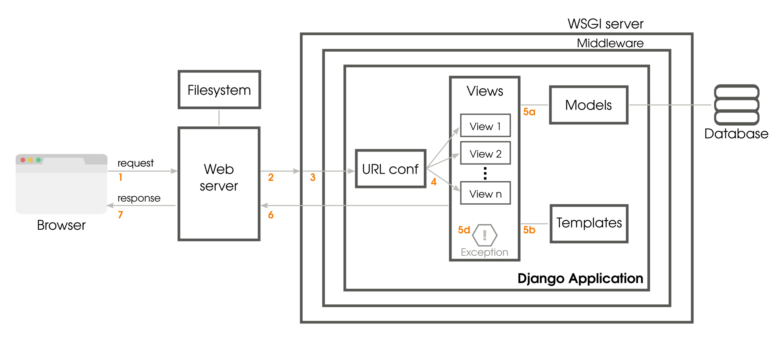

# Getting Started

- [Getting Started](#getting-started)
  - [What is Django](#what-is-django)
  - [Features of Django](#features-of-django)
  - [History behind Django](#history-behind-django)
  - [How Django works?](#how-django-works)
  - [Is Django MVC?](#is-django-mvc)

## What is Django

As the official description says, [Django](https://djangoproject.com) is a high-level Python web framework that encourages rapid development and clean, pragmatic design. In other words, it is a complete web framework with batteries included just like Python.

- It is free and open source, has a thriving and active community, great documentation, and many options for free and paid-for support.

## Features of Django

Django helps you write software that is

- **Batteries Included**: Django follows the "Batteries included" philosophy and provides almost everything developers might want to do "out of the box".

- **Versatile**: Django can be (and has been) used to build almost any type of website — from content management systems and wikis, through to social networks and news sites.

- **Secure**: Django helps developers avoid many common security mistakes by providing a framework that has been engineered to "do the right things" to protect the website automatically. For example, Django provides a secure way to manage user accounts and passwords, avoiding common mistakes like putting session information in cookies where it is vulnerable (instead cookies just contain a key, and the actual data is stored in the
database) or directly storing passwords rather than a password hash.

- **Scalable**: Django uses a component-based “shared-nothing” architecture (each part of the architecture is independent of the others, and can hence be replaced or changed if needed). Having a clear separation between the different parts means that it can scale for increased traffic by adding hardware at any level: caching servers, database servers, or application servers. Some of the busiest sites have successfully scaled Django to meet
their demands (e.g. Instagram and Disqus, to name just two).

- **Maintainable**: Django code is written using design principles and patterns that encourage the creation of maintainable and reusable code. In particular, it makes use of the *Don't Repeat Yourself (DRY)* principle so there is no unnecessary duplication, reducing the amount of code. Django also promotes the grouping of related functionality into reusable "applications" and, at a lower level, groups related code into modules (along the lines of the Model View Controller (MVC) pattern).

- **Portable**: Django is written in Python, which runs on many platforms. That means that you are not tied to any particular server platform, and can run your applications on many flavours of Linux, Windows, and Mac OS X. Furthermore, Django is well-supported by many web hosting providers, who often provide specific infrastructure and documentation for hosting Django sites.

## History behind Django

Django was initially developed between 2003 and 2005 by two programmers, *Adrian Holovaty* and *Simon Willison*, working on creating several local news websites in Kansas at the Lawrence Journal-World newspaper. After creating a number of sites, the team began to factor out and reuse lots of common code and design patterns. This common code evolved into a generic web development framework, which was open-sourced as the "Django" project in
July 2005.

At the time of writing this, Django has 3 major released versions:

  1. Django 1.x
  2. Django 2.x
  3. Django 3.x (Latest)

## How Django works?

To truly appreciate Django, you will need to peek under the hood and see the various moving parts inside. This can be both enlightening and overwhelming.

The preceding diagram shows the simplified journey of a web request from a visitor's browser to your Django application and back. The numbered paths are as follows:

1. The browser sends the request (essentially, a string of bytes) to your web server.

2. Your web server (say, Nginx) hands over the request to a Web Server Gateway Interface (WSGI) server (say, uWSGI) or directly serves a file (say, a CSS file) from the filesystem.

3. Unlike a web server, WSGI servers can run Python applications. The request populates a Python dictionary called environ and, optionally, passes through several layers of middleware, ultimately reaching your Django application.

4. URLconf (URL configuration) module contained in the `urls.py` of your project selects a view to handle the request based on the requested URL. The request has turned into HttpRequest, a Python object.

5. The selected view typically does one or more of the following things:

    a. Talks to a database via the models.
    b. Renders HTML or any other formatted response using templates
    c. Returns a plain text response (not shown)
    d. Raises an exception

6. The HttpResponse object gets rendered into a string, as it leaves the Django application.

7. A beautifully rendered web page is seen in your user's browser.

## Is Django MVC?

Model-View-Controller (MVC) is an architectural pattern invented by Xerox PARC in the 70s. Being the framework used to build user interfaces in Smalltalk, it gets an early mention in the GoF book.

Today, MVC is a very popular pattern in web application frameworks. A variant of the common question is whether Django is an MVC framework.

The answer is both yes and no. The MVC pattern advocates the decoupling of the presentation layer from the application logic. For instance, while designing an online game website API, you might present a game's high scores table as an HTML, XML, or comma-separated values (CSV) file. However, its underlying model class would be designed independently of how the data would be finally presented.

MVC is very rigid about what models, views, and controllers do. However, Django takes a much more practical view to web applications. Due to the nature of the HTTP protocol, each request for a web page is independent of any other request. Django's framework is designed like a pipeline to process each request and prepare a response.

Django calls this the Model-Template-View (MTV) architecture. There is a separation of concerns between the database interfacing classes (model), request-processing classes (view), and a templating language for the final presentation (template).

If you compare this with the classic MVC — a model is comparable to Django's Models; a view is usually Django's Templates, and the controller is the framework itself that processes an incoming HTTP request and routes it to the correct view function.
